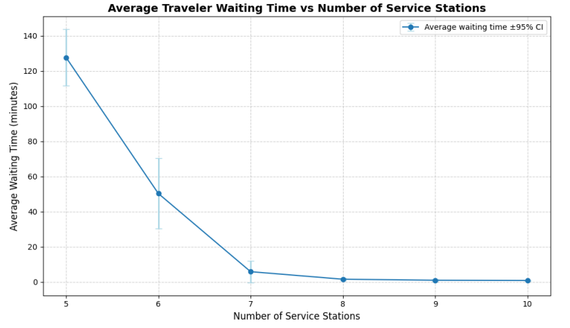
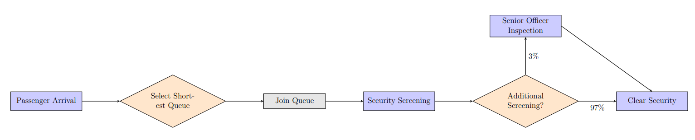

# Airport Security Screening: A Discrete-Event Simulation

## Project Structure

```
|
├── .gitignore
├── README.md 
|
├── assets/            
│   ├── system_flowchart.png
│   └── average_wait_time_graph.png
│
└── src/                
    └── simulation.py
```


### A project analyzing queueing dynamics and system bottlenecks in a simulated airport security environment.



## Overview 

This project is a discrete-event simulation of an airport security screening system, developed to analyze queueing dynamics and identify system bottlenecks. It models passenger arrivals, multiple parallel screening stations, and the impact of a shared senior officer for additional security checks. The goal was to determine the optimal number of service stations to balance efficiency and traveler experience, using concepts from **Queueing Theory** and **Systems Analysis**.

## System Model and Dynamics 

The simulation models a system where passengers arrive and join one of several parallel queues for a security screening. A small percentage (3%) are flagged for additional screening, which is handled by a single senior officer. This officer is a shared resource and can become a bottleneck, causing the station that flagged the passenger to become **blocked** until the officer is free.

The core passenger flow is detailed below:


*Figure 1: Passenger flow through the security screening system.*

## Key Concepts & Features 

* **Discrete-Event Simulation:** The system is modeled by processing events from a priority queue, advancing time to the next scheduled event.
* **Object-Oriented Design:** The simulation is built with a modular, object-oriented structure, including classes for the `Airport`, `Station`, `Passenger`, and `SeniorOfficer`.
* **Queueing Theory:** Explores concepts from M/G/c queues, including blocking behavior and load balancing.
* **Shortest-Queue Routing:** Arriving passengers dynamically choose the station with the shortest line to balance the load across all stations.
* **Bottleneck Analysis:** Identifies the senior security officer as a critical shared resource that can cause cascading, system-wide delays.

## Key Findings & Conclusion 

The empirical analysis showed that the "join-the-shortest-queue" strategy is highly effective at balancing the load. However, the shared senior officer was identified as the primary bottleneck, with officer congestion leading to a sharp increase in overall queue lengths and wait times.

The primary conclusion is that **7 service stations** provide the optimal balance between minimizing passenger wait times and avoiding the underutilization of resources. As shown in the graph at the top, adding stations beyond this point yields diminishing returns on performance improvement.


The script will run a simulation with the optimal configuration (7 stations) and print the resulting average passenger wait time.

## Tech Stack 

* **Language:** Python
* **Libraries:** NumPy (for random number generation), scipy.stats (for probability distributions)
